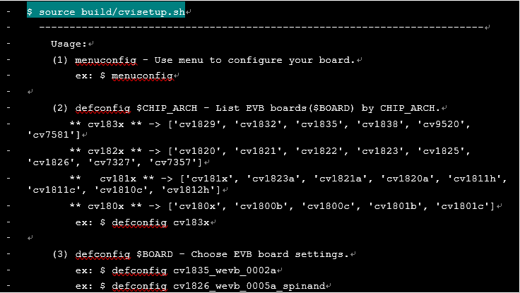
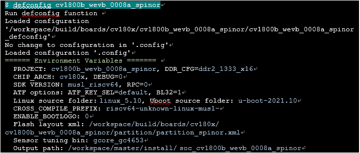

开发环境
========================================================================

目的
------------------------------------------------------------------------

此份文件说明Linux开发环境。Linux开发环境的搭建U-boot、Linux内核、根文件系统(rootfs)以及内核和根文件系统的烧写，以及创建网络开发环境和启动 Linux 开发。

本文档提供客户端可以快速搭建Linux环境，并将自行开发的应用程序移植到Linux操作系统上面。

如何编译内核
------------------------------------------------------------------------

-  在HOST端ubuntu环境要编译SDK，需要安装以下工具

::

   请参阅SDK编译及使用说明_V1.0.docx 建构编译环境

-  设定环境变量(以cv1800b_wevb_0008a_spinor为例)

-  选定EVB cv1800b_wevb_0008a_spinor

-  编译linux kernel

-  产生刻录档 boot.{spinor, spinand, emmc}

