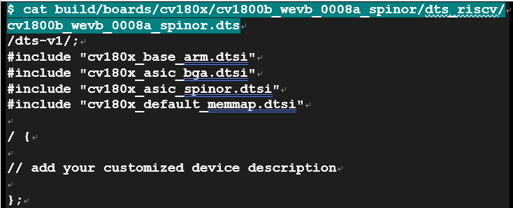
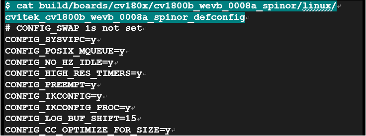
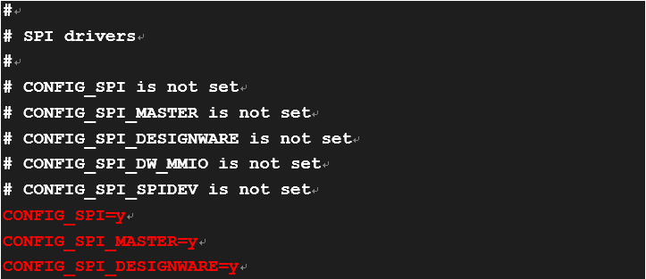
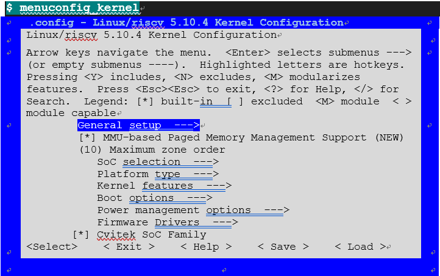

LINUX内核
========================================================================

在sdk_source目录下可以找到内核的程序代码

配置内核DTS
-------------------------------------------------------------------------

如果要针对内核的模块增减修改，可以透过修改DTS(\*1)的方式来完成，每张EVB会有dts档案来定义其device tree，以cv1800b_wevb_0008a_spinor为例，其DTS档案定义在档案路径如下 :

上述*.dtsi(device tree source include files)为芯片默认值, 不建议直接更改, 
若要修改默认值，建议使用 /delete-node/方式修改

*(*1) u-boot 和 kernel 使用共享DTS*

配置kernel configuration
-------------------------------------------------------------------------

如果要针对内核的组态修改，可以直接修改kernel 组态档，以cv1800b_wevb_0008a_spinor为例，其defconfig档案定义在档案路径如下

-  使用修改defconfig档案方式 范例 (新增支持SPI driver)

-  使用command line - setconfig_kernel 方式

-  使用 Graphic user interface line - menuconfig_kernel 方式

